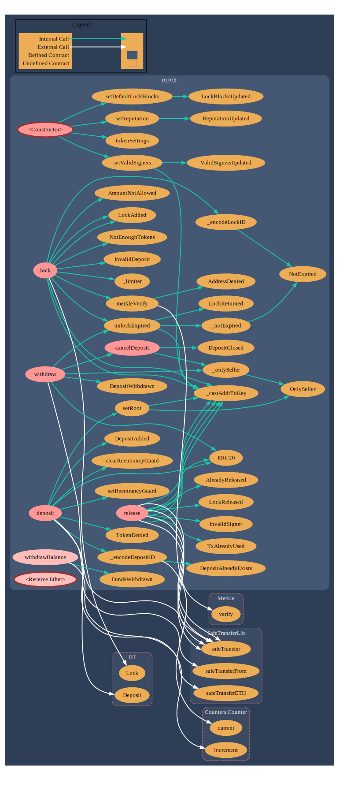

# p2pix-smart-contracts

**Repository for P2Pix EVM contracts to be imported by the project.**

## SM Dependency Tree

```rs
./contracts/
├── DataTypes.sol
├── EventAndErrors.sol
├── lib
│   ├── auth
│   │   └── Owned.sol
│   ├── interfaces
│   │   └── IReputation.sol
│   ├── mock
│   │   └── mockToken.sol
│   ├── tokens
│   │   └── ERC20.sol
│   └── utils
│       ├── Counters.sol
│       ├── FixedPointMathLib.sol
│       ├── MerkleProofLib.sol
│       ├── ReentrancyGuard.sol
│       └── SafeTransferLib.sol
├── p2pix.sol
└── Reputation.sol
```
## Callgraph


## Usage

### Pre Requisites

Before installing, create a `.env` file and set a BIP-39 compatible mnemonic and other env criteria as in `.env.example`.

### Install

```sh
$ yarn install
```

### Compile

```sh
$ yarn compile
```

**_NOTE:_** TypeChain artifacts generated at compile time.

### Test

```sh
$ yarn test
```

### Report Gas

```sh
$ REPORT_GAS=true yarn test
```

**_NOTE_:** Gas usage per unit test and average gas per method call.

### Clean

Delete the smart contract artifacts and cache:

```sh
$ yarn clean
```

## Importing artifacts

To import artifacts on the project use the following:

```ts
import P2PIXArtifact from 'p2pix-smart-contracts/artifacts/contracts/p2pix.sol/P2PIX.json'
```

To grab deployment addresses you can just grab from deploys folder:

```ts
import localhostDeploys from 'p2pix-smart-contracts/deploys/localhost.json'
```


## Deploying to local environment

On the first teminal, use the following command and import some wallets to your Metamask, then connect to the network pointed:

```sh
yarn hardhat node
```

On the second teminal, run the following commands:

```sh
yarn deploy1:localhost
yarn deploy2:localhost
```

**_NOTE_:** The second script transfers 2M tokens to the first wallet of the node.
To use the P2Pix smart contract first transfer some of the tokens to other wallets.
